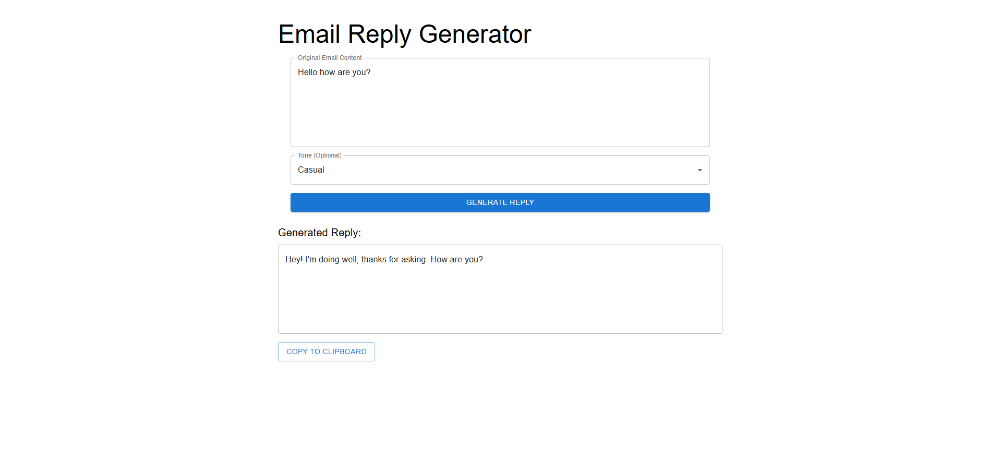
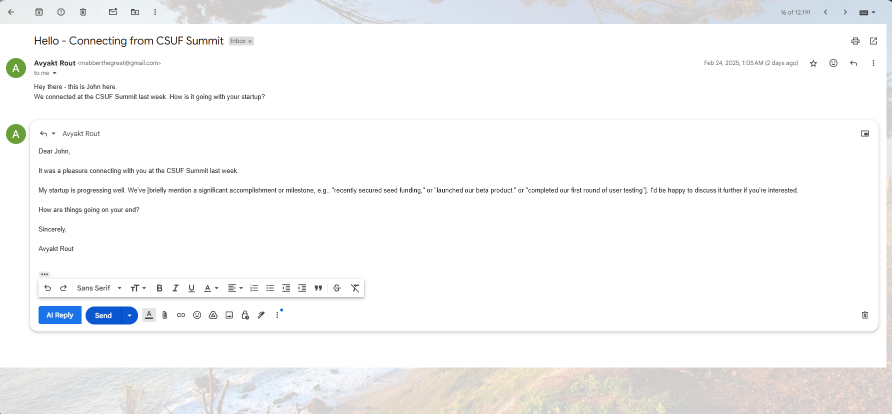

# AI Email Reply Generator & Gmail Chrome Extension

## Overview

This project is an **AI-powered Email Reply Generator** designed to help users craft prompt and effective email responses. It comprises:

- A **Backend API** developed with Spring Boot.
- A **Frontend Interface** built using React.
- A **Chrome Extension for Gmail** that integrates an "AI Reply" button into the Gmail interface, enabling users to generate responses directly within their email drafts.

## Screenshots
You can add screenshots of the web application and Chrome extension in this section.

Example:
```


```

## Features

- **AI Email Reply Generator (Web Application)**
  - Input an email message and select a desired tone (e.g., Casual, Professional, Friendly).
  - Generates a tailored response based on the chosen tone.
  - One-click copy-to-clipboard functionality.

- **Gmail Chrome Extension**
  - Adds an "AI Reply" button to the Gmail compose window.
  - Automatically generates AI-powered replies upon clicking.
  - Provides structured and context-aware email responses.

## Prerequisites

- **Java 17** or higher for the Spring Boot backend.
- **Node.js** (version 18 or higher) and **npm** for the React frontend.
- **Chrome Browser** for the extension.

## Installation

### 1. Backend Setup (Spring Boot Application)

1. **Navigate to the backend directory:**
   ```bash
   cd backend
   ```

2. **Build and run the application using Maven:**
   ```bash
   ./mvnw spring-boot:run
   ```
   The backend server will start, typically on `http://localhost:8080/`.

### 2. Frontend Setup (React Application)

1. **Navigate to the frontend directory:**
   ```bash
   cd frontend
   ```

2. **Install dependencies:**
   ```bash
   npm install
   ```

3. **Start the development server:**
   ```bash
   npm start
   ```
   The frontend will run on `http://localhost:5173/`.

### 3. Chrome Extension Installation

1. **Navigate to the `chrome-extension` directory:**
   ```bash
   cd chrome-extension
   ```

2. **Install dependencies:**
   ```bash
   npm install
   ```

3. **Build the extension:**
   ```bash
   npm run build
   ```
   This will generate a `dist` folder containing the extension files.

4. **Load the extension into Chrome:**
   - Open Chrome and navigate to `chrome://extensions/`.
   - Enable **Developer mode** (toggle in the top-right corner).
   - Click **Load unpacked** and select the `dist` folder generated in the previous step.

   The "AI Reply" button should now appear in Gmail's compose window.

## Usage

### Web Application

1. **Access the frontend interface** by navigating to `http://localhost:5173/` in your browser.
2. **Enter the original email content.**
3. **Select the desired tone** for the reply.
4. **Click "Generate Reply"** to receive an AI-generated response.
5. **Copy the response** to your clipboard with a single click.

### Gmail Chrome Extension

1. **Open Gmail** and start composing a new email or reply.
2. **Click the "AI Reply" button** added by the extension.
3. **A response will be generated** and inserted into the email draft.
4. **Review and edit** the response if necessary before sending.

## Technologies Used

- **Backend:** Spring Boot, Java
- **Frontend:** React, JavaScript, HTML, CSS
- **Chrome Extension:** JavaScript, HTML, CSS

## Contributing

Contributions are welcome! Please fork the repository and create a pull request with your changes. Ensure that your code adheres to the project's coding standards and includes appropriate tests.

## License

This project is licensed under the MIT License. See the [LICENSE](LICENSE) file for details.